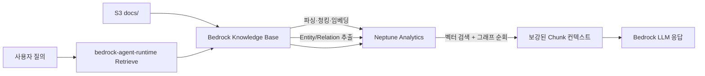
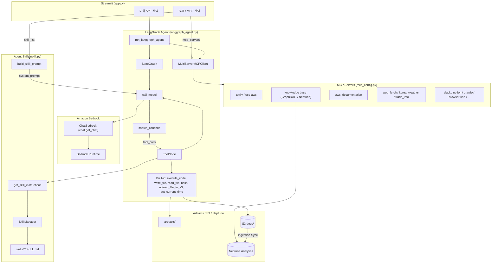

# GraphRAG와 함께 Agent 구현하기

Agent는 MCP뿐 아니라 [Skill](https://github.com/anthropics/skills)을 활용하여 다양한 기능을 편리하게 구현할 수 있습니다. 여기에서는 [LangGraph](https://www.langchain.com/langgraph)에서 Agent skill을 활용하는 방법에 대해 설명합니다. RAG는 **Amazon Bedrock Knowledge Bases GraphRAG + Amazon Neptune Analytics**로 구성하며, CloudFront - ALB - EC2로 Streamlit을 제공하고 LangGraph Agent에 MCP와 Skills를 연결합니다. 


## Graph RAG

이 프로젝트의 RAG는 **Amazon Bedrock Knowledge Bases GraphRAG + Amazon Neptune Analytics** 기반입니다. 벡터 유사도 검색에 Entity/관계 그래프 순회를 결합해 멀티홉·크로스 도큐먼트 질의에 대응합니다. 상세 개념은 [aws_graphrag_neptune_guide.md](./aws_graphrag_neptune_guide.md)를 참고하세요.

### 아키텍처



| 구성 | 값 |
|------|-----|
| 벡터 스토어 | Neptune Analytics (`NEPTUNE_ANALYTICS`) |
| 그래프 이름 | `rag-project` |
| 용량 | 32 m-NCU (POC) |
| 임베딩 | Titan Text Embeddings V2, 1024차원, FLOAT32 |
| 그래프 구성 모델 | Claude Haiku 4.5 (`CHUNK_ENTITY_EXTRACTION`) |
| 청킹 | Fixed size 300 토큰 / overlap 20% |
| 데이터 소스 | S3 `docs/` prefix |

인제스션 시 Knowledge Base가 Document → Chunk → Entity 노드와 `PART_OF` / `HAS_ENTITY` / 동적 관계 엣지를 Neptune에 적재합니다. 검색 시에는 질문 벡터로 유사 Chunk를 찾은 뒤 Entity 그래프를 확장해 컨텍스트를 보강합니다.

### 인프라 (`installer.py`)

배포 시 아래를 생성·갱신합니다.

1. S3 버킷 (`storage-for-rag-project-{account}-{region}`)
2. Knowledge Base IAM 역할 — `neptune-graph:GetGraph`, `Read/Write/DeleteDataViaQuery`
3. Neptune Analytics 그래프 + 벡터 인덱스 (차원 1024)
4. Bedrock Knowledge Base + GraphRAG 데이터 소스 (`contextEnrichmentConfiguration`)
5. CloudFront, AgentCore Web Search Gateway 등 공통 리소스

```bash
python installer.py
```

정리 시 Knowledge Base를 먼저 삭제한 뒤 Neptune 그래프를 삭제하세요. 순서를 바꾸면 KB가 깨지거나 그래프 과금이 남을 수 있습니다.

```bash
python uninstaller.py --delete-knowledge-base --delete-neptune
```

`application/config.json`에는 다음 키가 기록됩니다.

| 키 | 설명 |
|----|------|
| `knowledge_base_id` / `knowledge_base_name` | GraphRAG KB |
| `neptune_graph_id` / `neptune_graph_arn` / `neptune_graph_name` | Neptune Analytics 그래프 |
| `s3_bucket` / `sharing_url` | 문서 저장소 및 CloudFront |

### 검색 경로

| 경로 | 모듈 | 역할 |
|------|------|------|
| Streamlit RAG 모드 | `chat.run_rag_with_knowledge_base` | KB `retrieve` → LLM 답변 |
| Agent MCP | `mcp_server_retrieve.py` → `mcp_retrieve.py` | `knowledge base` MCP 도구로 동일 KB 검색 |

`mcp_retrieve.retrieve()`는 `bedrock-agent-runtime`의 `Retrieve` API를 호출합니다. Knowledge Base가 Neptune Analytics에서 벡터 검색과 Entity 그래프 순회를 수행한 뒤 보강된 Chunk를 반환합니다. 참조 메타데이터의 `from` 필드는 `GraphRAG`입니다.

문서 반영 절차:

1. 파일을 `s3://{s3_bucket}/docs/`에 업로드
2. Bedrock 콘솔(또는 API)에서 Knowledge Base **Sync**
3. Sync 완료 후 RAG / Agent(`knowledge base` MCP)로 질의

## Agent Skills

[Agent Skills](https://agentskills.io/specification)은 AI agent에게 특정 작업 수행 방법을 가르치는 재사용 가능한 지침 패키지입니다. Agent skills는 효과적으로 context를 관리하기 위하여 discovery, activation, execution의 과정을 거칩니다. 정리하면 agent가 관련된 skill의 name과 description을 읽는 discovery를 수행한 후에, SKILL.md에 포함된 instruction을 읽는 activation을 수행합니다. Agent는 instruction을 수행하는데 필요하다면 관련된 파일(referenced file)을 읽거나 포함된 코드(bundled code)를 실행합니다. 각 스킬은 `SKILL.md` 파일로 구성되며, YAML 프론트매터(name, description)와 상세 지침(워크플로, 코드 패턴 등)으로 이루어져 있습니다.

### Operation Architecture



| 모드 | 모듈 | 설명 |
|------|------|------|
| 일상적인 대화 | `chat.general_conversation` | 대화 이력 + ChatBedrock 스트리밍 |
| RAG | `chat.run_rag_with_knowledge_base` | Bedrock Knowledge Base GraphRAG 검색(`retrieve`) 후 ChatBedrock으로 답변 생성 |
| **Agent** | `langgraph_agent.run_langgraph_agent` | LangGraph StateGraph + built-in tools + MCP + Skills (단일 턴) |
| **Agent (Chat)** | `langgraph_agent.run_langgraph_agent` | Agent와 동일 + LangGraph checkpointer로 대화 이력 유지 |
| 번역하기 | `chat.translate_text` | 한국어 ↔ 영어 번역 |
| 이미지 분석 | `chat.summarize_image` | ChatBedrock 멀티모달 (이미지 + 텍스트) 분석 |

### Progressive Disclosure

시스템 프롬프트에는 스킬의 **이름과 설명만** XML 형태로 포함하고, 상세 지침은 agent가 `get_skill_instructions` 도구를 호출하여 **필요할 때만** 로드합니다. 이를 통해 프롬프트 크기를 최소화하면서도 agent가 다양한 스킬을 활용할 수 있습니다.

```xml
<available_skills>
  <skill>
    <name>pdf</name>
    <description>PDF 파일 읽기/병합/분할/OCR/폼 처리 등</description>
  </skill>
  ...
</available_skills>
```

### 스킬의 구조

각 스킬은 `SKILL.md` 파일 하나가 핵심이며, 필요에 따라 `scripts/`, `references/`, `assets/` 등의 보조 폴더를 포함할 수 있습니다.

```text
skills/
├── pdf/
│   ├── SKILL.md          # YAML 프론트매터 + 상세 지침
│   └── assets/           # 폰트 등 보조 리소스
├── notion/
│   └── SKILL.md
└── xlsx/
    └── SKILL.md
```

`SKILL.md`는 아래와 같이 YAML 프론트매터와 마크다운 본문으로 구성됩니다.

```markdown
---
name: pdf
description: PDF 파일 처리를 위한 스킬
---

# PDF Processing Guide

## Overview
이 가이드는 Python 라이브러리를 사용한 PDF 처리 작업을 다룹니다.
execute_code 도구로 아래의 Python 코드를 실행하세요.
...
```

### 스킬의 종류

스킬은 **베이스 스킬**과 **플러그인 스킬** 두 가지로 구분됩니다.

- **베이스 스킬** (`application/skills/`): Agent 모드에서 공통으로 사용하는 스킬입니다. 플러그인 모드에서도 기본으로 병합되어 함께 제공됩니다.

| 스킬 | 설명 |
|------|------|
| pdf | PDF 읽기/병합/분할/OCR/폼 처리 |
| notion | Notion API를 통한 페이지/DB/블록 관리 |
| memory-manager | MEMORY.md 기반 대화 메모리 관리 |
| docx | Word 문서 생성/편집/분석 |
| xlsx | 스프레드시트 작업/모델링 |
| pptx | PowerPoint 읽기/편집/생성 |
| myslide | AWS 테마 프레젠테이션 생성 |
| retrieve | Bedrock Knowledge Base GraphRAG 검색 (Neptune Analytics) |
| skill-creator | 새로운 스킬 설계/패키징 가이드 |

- **플러그인 스킬** (`application/plugins/<플러그인명>/skills/`): 특정 플러그인 모드에서만 활성화되는 스킬입니다.

| 플러그인 | 스킬 | 설명 |
|----------|------|------|
| productivity | memory-management | 약어/별칭 해석 포함 메모리 관리 |
| productivity | task-management | TASKS.md 기반 작업 관리 |
| frontend-design | frontend-design | 프론트엔드 UI 구현 가이드 |
| enterprise-search | search-strategy | 질의 분해/다중 소스 검색 전략 |
| enterprise-search | knowledge-synthesis | 다중 소스 결과 통합/출처 부여 |
| enterprise-search | source-management | MCP 검색 소스 연결/우선순위 |

### 스킬의 동작 흐름

[skill.py](./application/skill.py)에서 구현된 스킬의 동작 흐름은 다음과 같습니다.

1. **스킬 탐색**: `SkillManager`가 스킬 디렉토리를 스캔하여 `SKILL.md`의 YAML 프론트매터(이름, 설명)를 레지스트리에 등록합니다.
2. **프롬프트 구성**: `build_skill_prompt()`가 활성화된 스킬의 이름/설명을 `<available_skills>` XML로 시스템 프롬프트에 포함합니다.
3. **지침 로드**: 사용자 요청에 맞는 스킬이 있으면 agent가 `get_skill_instructions` 도구를 호출하여 상세 지침을 로드합니다.
4. **작업 수행**: 로드된 지침에 따라 `execute_code`, `write_file` 등의 도구를 사용하여 작업을 수행합니다.
5. **결과 전달**: 결과 파일이 있으면 `upload_file_to_s3`로 업로드하여 URL을 제공합니다.

활성화할 스킬은 `config.json`의 `default_skills`(베이스)와 `plugin_skills`(플러그인별)에서 설정하며, Streamlit UI에서도 체크박스로 선택할 수 있습니다.


## LangGraph에서 Skill의 구현

[chat.py](./application/chat.py)의 run_langgraph_agent는 사용자의 요청(query)를 Agent를 이용해 수행합니다. 여기서는 [app.py](./application/app.py)에서 선택한 MCP 서버의 리스트에서 mcp.json을 생성하여 server_params을 추출하고, MCP tool과 built-in tool을 추출하여 agent를 생성합니다. built-in tool에는 skill을 위한 get_skill_instructions과 execute_code, write_file, read_file 들이 있습니다. 

```python
async def run_langgraph_agent(query, mcp_servers):
    mcp_json = mcp_config.load_selected_config(mcp_servers)
    server_params = langgraph_agent.load_multiple_mcp_server_parameters(mcp_json)

    client = MultiServerMCPClient(server_params)        
    tools = await client.get_tools()

    builtin_tools = langgraph_agent.get_builtin_tools()
    tools = tools + builtin_tools
        
    app = langgraph_agent.buildChatAgent(tools)
    config = {
        "recursion_limit": 50,
        "configurable": {"thread_id": user_id},
        "tools": tools,
        "system_prompt": None
    }            
    inputs = {
        "messages": [HumanMessage(content=query)]
    }
            
    result = ""
    async for stream in app.astream(inputs, config, stream_mode="messages"):
        message = stream[0]    
        for content_item in message.content:
            if content_item.get('type') == 'text':
                text_content = content_item.get('text', '')
                result += text_content
                                
    return result
```

[langgraph_agent.py](./application/langgraph_agent.py)의 get_builtin_tools은 skill과 관련된 tool 들의 리스트를 리턴합니다. 이 tool중에 get_skill_instructions은 등록된 skill에 대한 정보를 리턴합니다.

```python
def get_builtin_tools():
    """Return the list of built-in tools for the skill-aware agent."""
    return [execute_code, write_file, read_file, upload_file_to_s3, get_skill_instructions]

@tool
def get_skill_instructions(skill_name: str) -> str:
    """Load the full instructions for a specific skill by name.

    Use this when you need detailed instructions for a task that matches
    one of the available skills listed in the system prompt.

    Args:
        skill_name: The name of the skill to load (e.g. 'pdf').

    Returns:
        The full skill instructions, or an error message if not found.
    """
    instructions = skill_manager.get_skill_instructions(skill_name)
    if instructions:
        return instructions
    available = ", ".join(skill_manager.registry.keys())
    return f"Skill '{skill_name}'을 찾을 수 없습니다. 사용 가능한 skill: {available}"
```

[langgraph_agent.py](./application/langgraph_agent.py)에서는 Skill을 관리하기 위한 SkillManager를 정의합니다. SkillManager가 initiate될 때에 _discover()는 skill directory에 있는 skill 정보를 가져와서 registry에 등록합니다. 등록된 skill 정보는  available_skills_xml를 통해 prompt에서 활용합니다. 

```python
@dataclass
class Skill:
    name: str
    description: str
    instructions: str
    path: str

class SkillManager:
    """Discovers, loads and selects Agent Skills following the Anthropic spec."""

    def __init__(self, skills_dir: str = SKILLS_DIR):
        self.registry: dict[str, Skill] = {}
        self._discover()

    def _discover(self):
        """Scan skills directory and load metadata (frontmatter only)."""
        for entry in os.listdir(self.skills_dir):
            skill_md = os.path.join(self.skills_dir, entry, "SKILL.md")
            if os.path.isfile(skill_md):
                meta, instructions = self._parse_skill_md(skill_md)
                skill = Skill(
                    name=meta.get("name", entry),
                    description=meta.get("description", ""),
                    instructions=instructions,
                    path=os.path.join(self.skills_dir, entry),
                )
                self.registry[skill.name] = skill

    # ---- prompt generation (progressive disclosure) ----
    def available_skills_xml(self) -> str:
        """Generate <available_skills> XML for the system prompt (metadata only)."""
        if not self.registry:
            return ""
        lines = ["<available_skills>"]
        for s in self.registry.values():
            lines.append("  <skill>")
            lines.append(f"    <name>{s.name}</name>")
            lines.append(f"    <description>{s.description}</description>")
            lines.append("  </skill>")
        lines.append("</available_skills>")
        return "\n".join(lines)

    def get_skill_instructions(self, name: str) -> Optional[str]:
        """Return full instructions for a skill (loaded on demand)."""
        skill = self.registry.get(name)
        return skill.instructions if skill else None

skill_manager = SkillManager()
```

LangGraph의 agent는 아래와 같이 구현합니다. 여기서 build_system_prompt은 SKILL에 대한 정보인 skills_xml과 SKILL_USAGE_GUIDE를 아래와 같이 포함합니다.

```python
async def call_model(state: State, config):
    last_message = state['messages'][-1]

    tools = config.get("configurable", {}).get("tools", None)
    custom_prompt = config.get("configurable", {}).get("system_prompt", None)

    system = build_system_prompt(custom_prompt)

    chatModel = chat.get_chat()
    model = chatModel.bind_tools(tools)

    prompt = ChatPromptTemplate.from_messages([
        ("system", system),
        MessagesPlaceholder(variable_name="messages"),
    ])
    chain = prompt | model
    response = await chain.ainvoke(messages)
    return {"messages": [response], "image_url": image_url}

SKILL_USAGE_GUIDE = (
    "\n## Skill 사용 가이드\n"
    "위의 <available_skills>에 나열된 skill이 사용자의 요청과 관련될 때:\n"
    "1. 먼저 get_skill_instructions 도구로 해당 skill의 상세 지침을 로드하세요.\n"
    "2. 지침에 포함된 코드 패턴을 execute_code 도구로 실행하세요.\n"
    "3. 생성된 파일은 upload_file_to_s3로 업로드하고 URL을 사용자에게 전달하세요.\n"
    "4. skill 지침이 없는 일반 질문은 직접 답변하세요.\n"
)
def build_system_prompt(custom_prompt: Optional[str] = None) -> str:
    """Assemble the full system prompt with available skills metadata."""
    if custom_prompt:
        base = custom_prompt
    else:
        base = BASE_SYSTEM_PROMPT

    skills_xml = skill_manager.available_skills_xml()
    if skills_xml:
        return f"{base}\n\n{skills_xml}\n{SKILL_USAGE_GUIDE}"
    return base
```


### Skill의 생성

OpenClaw의 [skill-creator](./application/skills/skill-creator/SKILL.md)를 참조하여 skill을 생성할 수 있도록 하였습니다.

```text
├── SKILL.md (must required)
│   ├── YAML frontmatter metadata (required)
│   │   ├── name: (required)
│   │   └── description: (required)
│   └── Markdown instructions (required)
└── Bundled Resources (optional)
    ├── scripts/          - Executable code (Python/Bash/etc.)
    ├── references/       - Documentation intended to be loaded into context as needed
    └── assets/           - Files used in output (templates, icons, fonts, etc.)
```


## 배포하기

### EC2로 배포하기

AWS console의 EC2로 접속하여 [Launch an instance](https://us-west-2.console.aws.amazon.com/ec2/home?region=us-west-2#Instances:)를 선택합니다. [Launch instance]를 선택한 후에 적당한 Name을 입력합니다. (예: es) key pair은 "Proceed without key pair"을 선택하고 넘어갑니다. 


Instance가 준비되면 [Connet] - [EC2 Instance Connect]를 선택하여 아래처럼 접속합니다. 


이후 아래와 같이 python, pip, git, boto3를 설치합니다.

```text
sudo yum install python3 python3-pip git docker -y
pip install "boto3>=1.43.32" "botocore>=1.43.32"
```

Workshop의 경우에 아래 형태로 된 Credential을 복사하여 EC2 터미널에 입력합니다.


아래와 같이 git source를 가져옵니다.

```python
git clone https://github.com/kyopark2014/graph-rag
```

아래와 같이 installer.py를 이용해 설치를 시작합니다. Neptune Analytics 그래프와 Bedrock Knowledge Base(GraphRAG)가 함께 생성됩니다.

```python
cd graph-rag && python3 installer.py
```

API 구현에 필요한 credential은 secret으로 관리합니다. 따라서 설치시 필요한 credential 입력이 필요한데 아래와 같은 방식을 활용하여 미리 credential을 준비합니다. 

- 일반 인터넷 검색: [Tavily Search](https://app.tavily.com/sign-in)에 접속하여 가입 후 API Key를 발급합니다. 이것은 tvly-로 시작합니다.  
- 날씨 검색: [openweathermap](https://home.openweathermap.org/api_keys)에 접속하여 API Key를 발급합니다. 이때 price plan은 "Free"를 선택합니다.

설치가 완료되면 CloudFront로 접속하여 Agent를 실행합니다. GraphRAG용 문서는 S3 `docs/`에 올린 뒤 Knowledge Base Sync를 실행합니다.


인프라가 더이상 필요없을 때에는 Knowledge Base를 먼저 삭제한 뒤 Neptune 그래프를 삭제합니다.

```text
python uninstaller.py --delete-knowledge-base --delete-neptune
```


### 배포된 Application 업데이트 하기

AWS console의 EC2로 접속하여 [Launch an instance](https://us-west-2.console.aws.amazon.com/ec2/home?region=us-west-2#Instances:)를 선택하여 아래와 같이 아래와 같이 "app-for-agent-skills"라는 이름을 가지는 instance id를 선택합니다.

[connect]를 선택한 후에 Session Manager를 선택하여 접속합니다. 


이후 아래와 같이 업데이트한 후에 다시 브라우저에서 확인합니다.

```text
cd ~/graph-rag/ && sudo ./update.sh
```

### 실행 로그 확인

[EC2 console](https://us-west-2.console.aws.amazon.com/ec2/home?region=us-west-2#Instances:)에서 "app-for-agent-skills"라는 이름을 가지는 instance id를 선택 한 후에, EC2의 Session Manager를 이용해 접속합니다. 

먼저 아래와 같이 현재 docker container ID를 확인합니다.

```text
sudo docker ps
```

이후 아래와 같이 container ID를 이용해 로그를 확인합니다.

```text
sudo docker logs [container ID]
```

실제 실행시 결과는 아래와 같습니다.


### Local에서 실행하기

AWS 환경을 잘 활용하기 위해서는 [AWS CLI를 설치](https://docs.aws.amazon.com/ko_kr/cli/v1/userguide/cli-chap-install.html)하여야 합니다. EC2에서 배포하는 경우에는 별도로 설치가 필요하지 않습니다. Local에 설치시는 아래 명령어를 참조합니다.

```text
curl "https://awscli.amazonaws.com/awscli-exe-linux-x86_64.zip" -o "awscliv2.zip" 
unzip awscliv2.zip
sudo ./aws/install
```

AWS credential을 아래와 같이 AWS CLI를 이용해 등록합니다.

```text
aws configure
```

설치하다가 발생하는 각종 문제는 [Kiro-cli](https://aws.amazon.com/ko/blogs/korea/kiro-general-availability/)를 이용해 빠르게 수정합니다. 아래와 같이 설치할 수 있지만, Windows에서는 [Kiro 설치](https://kiro.dev/downloads/)에서 다운로드 설치합니다. 실행시는 셀에서 "kiro-cli"라고 입력합니다. 

```python
curl -fsSL https://cli.kiro.dev/install | bash
```

venv로 환경을 구성하면 편리하게 패키지를 관리합니다. 아래와 같이 환경을 설정합니다.

```text
python -m venv .venv
source .venv/bin/activate
```

이후 다운로드 받은 github 폴더로 이동한 후에 아래와 같이 필요한 패키지를 추가로 설치 합니다.

```text
pip install -r requirements.txt
```

이후 아래와 같은 명령어로 streamlit을 실행합니다. 

```text
streamlit run application/app.py
```

### MCP

Plugin의 Connector는 MCP를 이용해 구현합니다. 이때 필요한 MCP 설정은 아래를 참조합니다. 

- [Slack](https://github.com/kyopark2014/mcp/blob/main/mcp-slack.md): Slack 내용을 조회하고 메시지를 보낼 수 있습니다. SLACK_TEAM_ID, SLACK_BOT_TOKEN으로 설정합니다.

- [Tavily](https://github.com/kyopark2014/mcp/blob/main/mcp-tavily.md): Tavily를 이용해 인터넷을 검색합니다. [installer.py](./installer.py)에서 secret으로 설정후에 [utils.py](./application/utils.py)에서 TAVILY_API_KEY로 등록하여 활용합니다.

- [knowledge base](./application/mcp_server_retrieve.py): Bedrock Knowledge Base GraphRAG(Neptune Analytics)로 검색합니다. IAM 인증을 이용하므로 별도로 credential 설정하지 않습니다. 자세한 구성은 [Graph RAG](#graph-rag)를 참고하세요.

- [web_fetch](https://github.com/kyopark2014/mcp/blob/main/mcp-web-fetch.md): playwright기반으로 url의 문서를 markdown으로 불러올 수 있습니다. 별도 인증이 필요하지 않습니다.

- [Google 메일/캘린더](https://github.com/kyopark2014/mcp/blob/main/mcp-gog.md): 구글 메일을 조회하거나 보낼 수 있습니다. Gog CLI를 설치하여 google 인증을 통해 활용합니다.

- [Notion](https://github.com/kyopark2014/mcp/blob/main/mcp-notion.md): Notion을 읽거나 쓸 수 있습니다. [installer.py](./installer.py)에서 secret으로 설정후에 [utils.py](./application/utils.py)에서 NOTION_TOKEN을 등록하여 활용합니다.

- [text_extraction](https://github.com/kyopark2014/mcp/blob/main/mcp-text-extraction.md): 이미지의 텍스트를 추출합니다. 별도 인증이 필요하지 않습니다.

### Memory Mode

Sidebar의 **Memory Mode**를 켜면 워크스페이스 Markdown 메모리(`MEMORY.md`, `memory/*.md`)용 `memory_search` / `memory_get` 도구가 Agent에 추가됩니다. AgentCore Memory는 사용하지 않습니다.

### Telegram과 연동

[python-telegram-bot](https://github.com/python-telegram-bot/python-telegram-bot)을 활용하여, polling 방식으로 Telegram 서버에 주기적으로 새 메시지를 확인하고, 메시지가 오면 chat.run_langgraph_agent를 호출해 Agent 응답을 생성한 뒤 다시 Telegram으로 보내줍니다. 상세한 코드는 [telegram_bot.py](./application/telegram_bot.py)을 참조합니다.

Telegram Token을 아래와 같이 생성합니다. 

1. Telegram에서 [@BotFather](https://t.me/BotFather)와 대화 시작하거나, https://t.me/BotFather 에 접속합니다.
2. /newbot 명령 입력
3. Bot 이름 입력 (예: OpenClaw Assistant)
4. 이후 BotFather가 제공하는 token을 복사합니다.

생성된 token은 아래와 같이 installer.py를 이용해 secret으로 저장합니다.

```text
python installer.py
```


아래와 같이 python-telegram-bot을 설치합니다.

```text
pip install python-telegram-bot
```

Streamlit과 별개로 아래 명령어를 telegram bot을 준비합니다.

```text
python telegram_bot.py
```

이제 telegram에서 메시지를 보내면 동작을 확인할 수 있습니다. 또한, 아래 명령어를 telegram에서 활용할 수 있습니다. 

```text
/start - 안내 메시지
/model <모델명> - AI 모델 변경 (예: /model Claude 4.5 Sonnet)
/mcp - 현재 MCP 서버 목록 확인
```

이때의 결과는 아래와 같습니다. 


### Kiro-Cli 설치

Kiro-Cli를 이용하면 손쉽게 더버깅이나 설치와 같은 작업을 지원 받을 수 있습니다. EC2에 SSM으로 접속시 ec2-user로 전환합니다.

```text
sudo su - ec2-user
```

아래와 같이 설치합니다.

```text
curl -fsSL https://cli.kiro.dev/install | bash
```

아래 방식으로 인증을 할 수 있습니다.

```text
$ kiro-cli login --use-device-flow
✔ Select login method · Use for Free with Builder ID

Confirm the following code in the browser
Code: VNCC-PKNS

Open this URL: https://view.awsapps.com/start/#/device?user_code=VNCC-PKNS
Device authorized
Logged in successfully
```

아래와 같이 실행합니다. 모델 설정은 claude-opus-4.6, claude-sonnet-4.6, claude-opus-4.5, claude-sonnet-4.5, claude-sonnet-4, claude-haiku-4.5, deepseek-3.2, minimax-m2.1, qwen3-coder-next 와 같이 선택할 수 있습니다.

```python
kiro-cli chat --model claude-sonnet-4.6
```


## Chat UI로 실행

Flask 기반 `chat_ui/app.py`가 정적 파일(`index.html`, `script.js`, `style.css`)과 API(`/api/chat`)를 함께 제공합니다. **반드시 HTTP로 접속**해야 하며, `index.html`만 탐색기에서 `file://`로 여는 방식은 API 호출이 되지 않습니다.

1. **의존성 설치** (저장소 루트에서 가상환경을 쓰는 경우 활성화한 뒤)

   ```bash
   cd chat_ui
   pip install -r requirements.txt
   ```

2. **서버 기동**

   ```bash
   python app.py
   ```

   기본 포트는 **5001**입니다. 다른 포트를 쓰려면 예를 들어 `PORT=8080 python app.py`처럼 환경 변수 `PORT`를 지정합니다.

3. **브라우저에서 열기**

   터미널에 표시되는 주소(예: `http://127.0.0.1:5001`)로 접속합니다. 루트(`/`)에서 `index.html`이 서빙되므로 **`chat_ui/index.html` 파일을 직접 더블클릭하여 `file://`로 열 필요가 없습니다.**

   - 정상: `http://127.0.0.1:5001/` 또는 `http://localhost:5001/`
   - 비권장: `file:///.../chat_ui/index.html` (CORS·경로 문제로 `/api/chat`이 동작하지 않을 수 있음)

4. **포트를 바꾼 경우** (`file://`로 HTML만 열어야 하는 특수한 경우) 브라우저 쪽 API 주소를 맞추려면 `index.html`의 `<head>` 안에 다음과 같이 지정할 수 있습니다.

   ```html
   <meta name="chat-api-base" content="http://127.0.0.1:8080">
   ```

### Message Trim

LangGraph 에이전트([application/langgraph_agent.py](./application/langgraph_agent.py)의 `call_model`)는 LLM 호출 직전에 **HumanMessage 기준 최근 N턴**만 남깁니다. LangGraph state의 `messages`는 checkpointer에 그대로 두고, **모델에 넘기는 메시지만** trim합니다. `history_mode=Enable`/`Disable` 모두 동일하게 적용됩니다.

**기본값:** `MAX_CONTEXT_TURNS = 5` (일반 채팅의 `SimpleMemory(k=5)`와 동일한 “최근 5턴” 의도)

**설정 변경:**

- [application/langgraph_agent.py](./application/langgraph_agent.py)의 `MAX_CONTEXT_TURNS` 상수 수정
- 또는 `create_agent()`에서 생성하는 config의 `max_turns` / `configurable.max_turns` 지정
- `max_turns=0`이면 trim 비활성화

상수와 trim 함수는 `langgraph_agent.py`에 정의합니다.

```python
# application/langgraph_agent.py
MAX_CONTEXT_TURNS = 5


def trim_messages_by_human_turns(messages: list, max_turns: int) -> list:
    """Keep messages from the last N HumanMessage turns (inclusive)."""
    if max_turns <= 0 or not messages:
        return messages

    human_indices = [i for i, msg in enumerate(messages) if isinstance(msg, HumanMessage)]
    if len(human_indices) <= max_turns:
        return messages

    return messages[human_indices[-max_turns]:]
```

`call_model`에서는 `ToolMessage` content 정규화 후 trim을 적용합니다.

```python
# application/langgraph_agent.py — call_model() 내부
        max_turns = (
            config.get("configurable", {}).get("max_turns")
            or config.get("max_turns")
            or MAX_CONTEXT_TURNS
        )
        trimmed = trim_messages_by_human_turns(messages, max_turns)
        if len(trimmed) < len(messages):
            logger.info(
                f"trimmed messages from {len(messages)} to {len(trimmed)} "
                f"(max_turns={max_turns})"
            )
            messages = trimmed

        prompt = ChatPromptTemplate.from_messages([
            ("system", system),
            MessagesPlaceholder(variable_name="messages"),
        ])
        chain = prompt | model
        async for chunk in chain.astream({"messages": messages}):
            ...
```

에이전트 config는 `create_agent()`에서 생성하며, `history_mode`와 관계없이 `max_turns`를 전달합니다.

```python
# application/langgraph_agent.py — create_agent()
    if history_mode == "Enable":
        app = buildChatAgentWithHistory(tools)
        config = {
            "recursion_limit": 500,
            "configurable": {"thread_id": chat.user_id},
            "tools": tools,
            "system_prompt": system_prompt,
            "max_turns": MAX_CONTEXT_TURNS,
        }
    else:
        app = buildChatAgent(tools)
        config = {
            "recursion_limit": 500,
            "configurable": {"thread_id": chat.user_id},
            "tools": tools,
            "system_prompt": system_prompt,
            "max_turns": MAX_CONTEXT_TURNS,
        }
```

**`max_turns=5`의 의미**

- **사용자 HumanMessage 5개**와, 각 턴에 이어진 **모든 후속 메시지**를 유지
- 1턴 = `HumanMessage` 1개 + 그 뒤의 `AIMessage`, `ToolMessage`, 도구 feedback loop 전체
- 도구를 여러 번 호출해도 **같은 사용자 질문이면 1턴**으로 카운트

**예 (도구 사용 포함)**

```
Human(Q1) → AI(tool_calls) → ToolMessage → AI(A1)
Human(Q2) → AI(A2)
Human(Q3) → AI(tool_calls) → ToolMessage → AI(A3)
```

`max_turns=2`이면 **Q2부터** 유지:

```
Human(Q2) → AI(A2) → Human(Q3) → AI(tool_calls) → ToolMessage → AI(A3)
```

**메시지 개수 trim과의 차이**

| 방식 | `N=5`일 때 |
|------|------------|
| 이전 (메시지 개수) | 메시지 객체 5개만 유지 → 도구 루프 때문에 사용자 턴 수가 불규칙 |
| 현재 (HumanMessage 턴) | 사용자 질문 5개 + 각 턴의 AI/Tool 응답 전체 유지 |

**Checkpointer와의 관계**

- `history_mode=Enable`일 때 `MemorySaver` checkpointer에는 **전체 대화 이력**이 저장됩니다.
- trim은 LLM 컨텍스트 윈도우 관리용이며, 저장된 history를 삭제하지 않습니다.
- 로그에서 `trimmed messages from X to Y (max_turns=5)`로 trim 여부를 확인할 수 있습니다.

## 실행 결과

아래와 같이 SKILL 생성을 요청합니다.


skill-creater가 아래와 같이 tavily-search라는 skill을 생성합니다.


아래와 같이 skill이 생성되었습니다.


이제 아래와 같이 tavily-search를 이용해 실행할 수 있습니다.


## Reference

[Amazon Bedrock Knowledge Bases GraphRAG](https://docs.aws.amazon.com/bedrock/latest/userguide/knowledge-base-build-graphs.html)

[Amazon Neptune Analytics](https://docs.aws.amazon.com/neptune-analytics/latest/userguide/)

[aws_graphrag_neptune_guide.md](./aws_graphrag_neptune_guide.md) — 이 저장소의 GraphRAG 개념·운영 가이드

[anthropics / skills](https://github.com/anthropics/skills)

[Agent Skills](https://agentskills.io/home)

[Notion Skills for Claude](https://www.notion.so/notiondevs/Notion-Skills-for-Claude-28da4445d27180c7af1df7d8615723d0)

[Claude Code Skills](https://support.claude.com/en/articles/12512176-what-are-skills)

[example skills](https://github.com/anthropics/skills)

[Agent Skills for Strands Agents SDK](https://github.com/aws-samples/sample-strands-agents-agentskills)

[Claude Code Plugins: Orchestration and Automation](https://github.com/wshobson/agents/tree/main)

[Deep Agents CLI](https://github.com/langchain-ai/deepagents/tree/master/libs/cli)

[Using skills with Deep Agents CLI](https://www.youtube.com/watch?v=Yl_mdp2IiW4)

[Open Agent Skills](https://skills.sh/)
